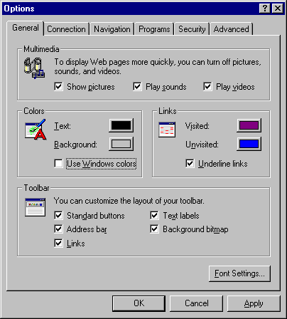
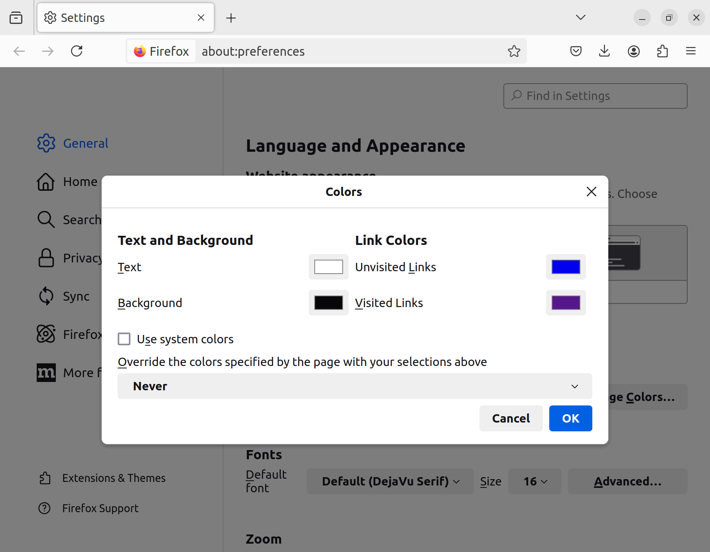
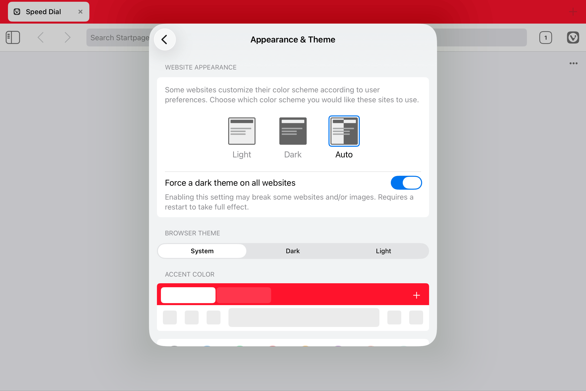

# stylelint-root-colors

[](https://www.npmjs.com/package/stylelint-root-colors)
[](https://github.com/SaekiTominaga/stylelint-plugin/actions/workflows/package-root-colors.yml)

## Summary

It is recommended to use `color` and `background-color` together on the root element.

Typically, the term <dfn>[root element](https://drafts.csswg.org/css-display-4/#root-element)</dfn> refers to the `<html>` element. However, the [CSS specification](https://www.w3.org/TR/css-backgrounds-3/#body-background) states that <q>It is recommended that authors of HTML documents specify the canvas background using the `BODY` element rather than the `HTML` element</q>. Therefore, this plugin performs linting on the `<body>` element by default.

```css
/* 🆖 Do not specify only either `color` or `background-color` in the root element */
body {
  color: #000;
}

body,
.foo {
  background-color: #fff;
}

/* 🆗 It is good to specify both `color` and `background-color` */
body {
  background-color: #fff;
  color: #000;
}

/* 🆗 You may use the `background` short hand */
body {
  background: #fff;
  color: #000;
}

/* 🆗 The `color` and `background-color` are not required */
body {
}

/* 🆗 Except in the root element, only either `color` or `background-color` may be specified */
.foo {
  color: #000;
}
```

## Why?

The text and background colors in browsers have long been customizable by users.

The following screenshot shows a user-defined dark mode configuration in Firefox's “Manage Colors” settings, where the text color is set to white and the background color is set to black.

▼ Internet Explorer 3 (1996) <q>General</q> Settings


▼ Firefox 130 (2024) <q>Colors</q> Settings


And around 2024, browsers began implementing forced dark mode.

▼ iOS Vivaldi 7.7 (2025) <q>Appearance & Theme</q> Settings


In this case, if only either `color` or `background-color` is specified in the root element through producer stylesheets, the text will be unreadable in some cases.

The following screenshot shows a web page with `body { color: black }` displayed after setting iOS's system appearance to <q>Dark</q> and enabling Vivaldi's <q>Force a dark theme on all websites</q>.

▼ iOS Vivaldi 7.7 (2025) Rendering


See also [F24 in Techniques for WCAG 2.2](https://www.w3.org/WAI/WCAG22/Techniques/failures/F24).

## Usage

```javascript
/** @type {import('stylelint').Config} */
export default {
  plugins: ['stylelint-root-colors'],
  rules: {
    'plugin/root-colors': [
      true,
      {
        root: ['#root'],
      },
    ],
  },
};
```

### Rule options

| name   | type                 | description                                                                    |
| ------ | -------------------- | ------------------------------------------------------------------------------ |
| `root` | `string \| string[]` | Specifies the selector of the root element. If omitted, it will be `['body']`. |
